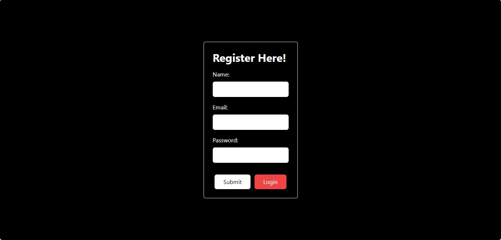
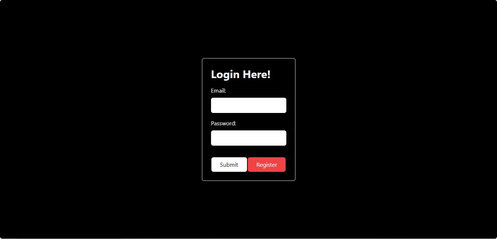
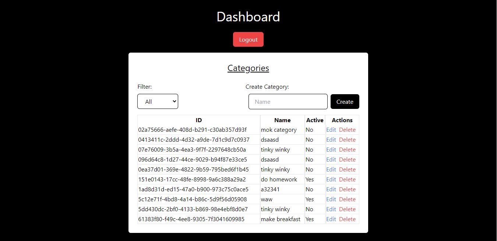

<!-- https://w19-react-features-anggih-p.vercel.app/ -->

# React Features

## Preview

## Link

### [https://w19-react-features-anggih-p.vercel.app/](https://w19-react-features-anggih-p.vercel.app/)

### [https://documenter.getpostman.com/view/2478364/2s93sf2Ap7#42e250a6-0f3f-45d2-8550-fef0a9c90fc8](https://documenter.getpostman.com/view/2478364/2s93sf2Ap7#42e250a6-0f3f-45d2-8550-fef0a9c90fc8)

## 🛠️ Tools

